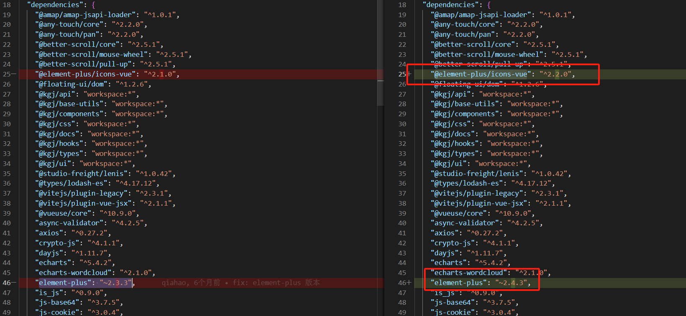
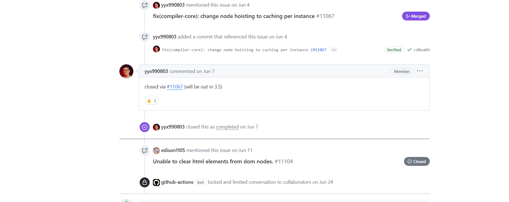

# 单页应用如何提高加载速度
- 路由懒加载
- 代码分割，按需加载，首先加载重要的资源 特别是首屏加载的时候，其余不重要的内容可以推迟加载
- 资源的压缩 gzip、cdn

# 首屏加载如何优化
- 减少入口文件的体积 （怎么做？）
  - 路由懒加载 这样其他路由的文件不会打包进来，首次加载的时候包体积就不会太大
- 组件库按需加载 减少组件库包的体积 或者直接上cdn
   

# react 、vue 、ts、vite、js、css


# 项目优化
- 解决项目存在已久的内存飙升问题
  - 首先通过代码注释的方式，找到表格的缺省图有问题，导致内存无法回收，排查发现图片是使用svg组件的形式书写，查询资料后发现这种方式确实会导致内存无法回收，所以将项目中的svg组件全部替换成iconfont的形式
  - 后续发现el-dialog存在的情况下内存也无法正常回收，再issue中发现是teleport的问题，该问题再**3.3.6**版本中进行了修复，所以后续对项目vue版本进行了升级，参考地址  https://github.com/vuejs/core/pull/6529
  - 再排查svg组件问题的时候其实有注意到issue中提到的静态提升问题导致的内存飙升的问题，但是在尝试禁用静态提升后发现内存也没有完全回收，原本以为是方向错了，后面经过尝试，发现是element-plus和@element-plus/icons-vue早期版本并没有取消静态提升，后面进行版本的升级。element-plus  2.4.3版本使用的是新版的icon 
  
https://github.com/element-plus/element-plus-icons/pull/65  
  - 自己项目内部vite.config.ts需要添加配置， 取消静态提升
  ```js
  vue({ template: { compilerOptions: { hoistStatic: false } } })
  ```
  - 后续vue的3.5版本已经对该问题进行了修复  
   https://github.com/vuejs/core/pull/11067
   


  
