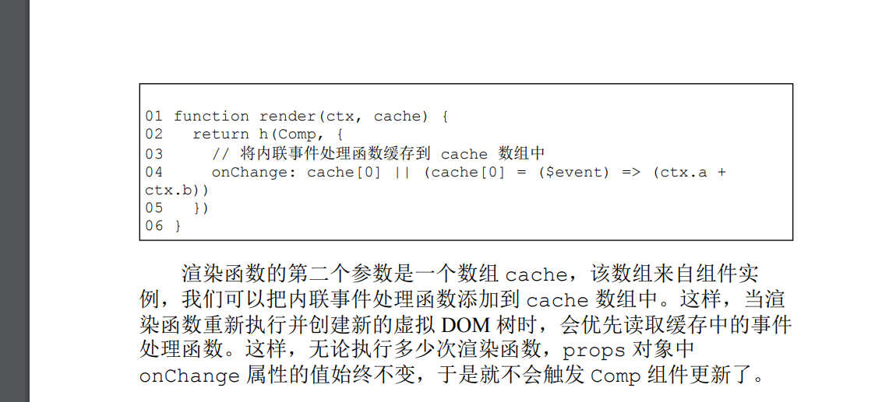
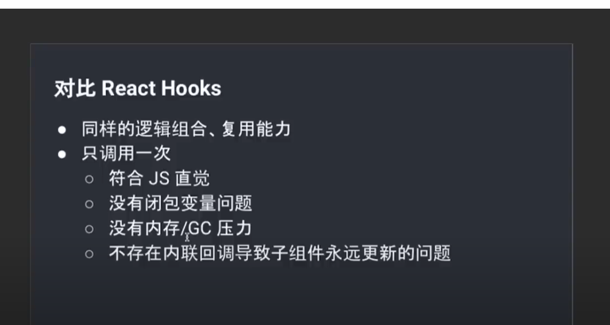

# Vue和React有什么不同
- 数据流不同：
  - vue是双向数据并且是响应式的，具体体现在vue会在初始化的时候会对数据做代理，在使用到的地方进行getter依赖收集，后续数据发生变化，自动更新视图。
  - react是单向数据流，并且需要调用特定api进行手动渲染，例如setState，useState等
- 数据更新机制不同
  - vue数据更新是同步的，视图渲染是异步的
  - react推崇不可变数据，因此他的数据更新也是异步，react18之前在生命周期函数和合成事件中表现为异步，在原生事件中表现为同步。 在react18优化批处理之后，在任何地方调用setState都会批处理，因此都表现为异步
- 事件处理机制不同
  - vue使用addEventListener进行事件的绑定
  - react进行事件委托，16只委托了冒泡阶段 17冒泡和捕获阶段都委托。16中将合成事件委托到document上，17委托到root元素
- 设计理念不同
  - vue是典型的运行时+编译时框架，react是重运行时框架
  - vue大多使用模版进行开发，react使用jsx，模板的好处在于在编译阶段可以进行静态分析，提取有效的信息，比如区分动静态节点等，有利于渲染阶段的diff对比
  - react的jsx因为必须等函数执行完才知道真正返回的dom结构，相对来说更灵活，但是也失去了静态编译的优化的特点
- 更新机制不同
  - vue更新颗粒度是组件，而react的更新是自上而下所有组件都需要进行更新，需要自己手动进行优化，例如继承PureComponent、使用React.memo等

# vite打包优化
- vue如果明确知道项目不会使用某些特性，可以把特性关闭，较少vue体积，例如不是有options的api
- 动态导入，使用import(xxx)语法，打包的时候rollup会将该文件单独打成个一个包，页面使用的时候就可以动态加载，优化初始化加载时间
- 代码分割 可以手动的将某些模块打包在一起，如果不指定，所有没有分包出去的文件最终都会打包到主bundle中，导致包太大，加载太慢，可以手动指定某几个模块打包在一起，减少包体积。

# 命令式和声明式框架
```js
// 01 - 获取 id 为 app 的 div 标签
// 02 - 它的文本内容为 hello world
// 03 - 为其绑定点击事件
// 04 - 当点击时弹出提示：ok
命令式的实现
 $('#app') // 获取 div
.text('hello world') // 设置文本内容
.on('click', () => { alert('ok') }) // 绑定点击事件

声明式的实现
 <div @click="() => alert('ok')">hello world</div>
```
- 命令式更加关注**过程**，像jq，而声明式更加关注**结果**例如vue的模板
- vue帮我们封装了整个过程，但是内部最终还是使用命令式实现的

# 运行时和编译时的区别
- 纯运行时：提供一个render函数，然后根据入参（vnode对象）直接渲染成dom
- 运行时编译 提供一个compile函数，将html编译成vnode，然后调用render函数渲染dom
- 纯编译时 使用compile函数，将html直接编译成js代码进行dom的挂载


# vue2为什么不能使用下标修改数组，vue3可以
https://juejin.cn/post/7350585600859308084
-首先数组长度的完全不固定的，所以你无法在定义初期就给他设置defineProperty进行劫持，这个方案根本就是不可行的，其次数组数据量一多的话，给他们都做劫持是非常耗性能的，而且没有太多的必要。所以vue2选择重写数组的方法，来进行依赖的收集
- vue3的话使用proxy是可以劫持到未定义的索引值的设置，所以不需要$set这个api了，但是他也重写了数组的方法，主要是因为一些比如push、pop等方法的执行，首先会收集length这个依赖，然后又对他进行set，这会导致无限循环的问题，所以重写这些方法，在调用的时候阻止依赖的收集。那么该方法最终都会修改到数组的元素，所以都会走到set方法中，然后手动将与length相关的effect拿出来执行。
- vue3还重写一些includes等查找方法的原因是，当数组是如下格式的时候：arr=[{a:1}]，调用查找方法的时候，实际上是在代理对象中找数据，这样的话是找不到的，所以重写方法，主要思路就是现在代理对象中找，找不到再去原始对象中查找

# vue中slot插槽使用响应式数据，组件怎么更新的
```js
<Component>{{count}}</Component>

```
首次渲染的时候，count收集的effect是子组件，所以当父组件中的count值发生变化，自然触发的是子组件的更新，而不是整个父组件的更新


# vue中的keepalive
- 在第一次渲染的时候调用render函数，会在内部的缓存数据中查找，因为第一次是肯定找不到缓存的，所以还是会走基础的组件挂载流程，并且将vnode缓存到cash数据中
- 当第二次进入组件的时候，执行render函数，从cash中找到缓存的vnode，直接将缓存中的组件实例赋值给vnode，然后设置keepalive属性为true，这样当走到patch函数的时候，判断vnode的keepalive属性是true就不会走组件的mounte过程，而是直接走keepalive组件特有的activite函数，即直接将缓存的真实dom插入到页面中.
- 
- 


！！！但是vue3为什么要加入 创建隐藏容器的操作呢？？？？？
# vue中vnode的props属性处理
- html attribute和dom property是有区别的 可以简单的认为html attribute是用来初始化dom property的，在dom属性中不一定能找到与html属性一一对应的值，比如dom中的className 在html中是class，vue首先通过判断key在dom对象中是否存在，存在的话直接设置，不存在再通过setAttribute属性设置
- 对于class，因为设置classList性能更好，所以在setAttribute、className、classList中选择了className
- 事件设置的时候，vue把类似onXxx以on开头的props当做事件给他通过addEventListener绑定事件，不过并不是直接给他绑定传入的事件，而是构建出一个函数，把传入的事件储存起来，这样就不需要每次更新事件的时候就去移除事件和重新绑定事件了


# <span id="vue3的编译优化">vue3的编译优化</span>
- block和patchFlag 在编译阶段通过静态分析，得出动态节点已经对应后续需要更新的动态属性，通过patchFlag标识，block其实就是vnode，只是在原有的vnode中多了一个dynamicChildren字段
- 实际上，除了模板中的根节点需要作为 Block 角色之外，任何带
有 v-for、v-if/v-else-if/v-else 等指令的节点都需要作为
Block 节点，因为该指令都会使模版变得不稳定
- 在初次渲染的时候，会收集dynamicChildren和patchFlag，这样在更新阶段不需要递归的去处理子节点，而是直接循环dynamicChildren，并且根据patchFlag属性，进行靶向更新，而不需要从头到尾全量循环更新他的props、children等
- 静态提升，将静态虚拟节点提升到render函数外部，防止每次render的时候都要重复创建，但是vue版本中因为静态提升会导致内存不断的飙升，无法进行正常的垃圾回收，可以通过vite配置取消静态提升，并且element-plus组件库的版本需要升级到2.4.3以上。该bug已经在3.5版本进行修复
- 针对大量静态提升的东西，还可以采用预字符串化，后续该静态节点可以直接使用innerhtml进行渲染
- 内联事件处理函数的缓存
- v-once 可以避免组件更新时候无用的diff  


# <span id="proxy-vs-defineProperty">vue3为什么要使用proxy代替defineProperty</span>  
- 更强大的劫持能力：proxy能拦截更多的操作，比如对象的新增、删除属性
- 更好的性能 ：proxy的代理颗粒度是整个object，而defineProperty是每个key。 proxy的代理是懒代理，初始只对外层对象进行代理，内层对象只有在访问到的时候才会进行劫持。而defineProperty在渲染初期就要递归的对所有key进行拦截，更耗费性能


# vue的hook 和react的hooks 有什么异同点
  相同点：
  - 都是用来做逻辑的复用和拆分
  不同点
  - vue的组合式api只会在初始化的时候执行一次，而react的hooks在初始化和更新的时候都会重新执行一次，这是因为他的设计机制问题，因为组件更新其实就是重新执行一次函数生成新的vnode。而每次渲染都要执行一次函数，会有一定的闭包变量和gc压力。
  - react的hooks是基于链表的形式实现的，他在每次函数执行的时候都必须保证顺序的一致性，因此无法再if、for等语句内部使用，有严格的使用规范，以use开头的函数都会被当做的hooks，而vue没有这些限制，本质就是普通的函数



# vue3是如何变得更快的，diff算法有什么优化？
- 主要是在编译阶段加入block和patchFlag，使得后续更新的时候可以直接更新dynamicChildren数组，并且对具体的属性进行靶向更新，大大提升性能，因为不再需要全量的递归进行比对


# vue3性能提升主要体现在哪些方面？
https://vue3js.cn/interview/vue3/performance.html#%E4%B8%80%E3%80%81%E7%BC%96%E8%AF%91%E9%98%B6%E6%AE%B5   
- <a href="#vue3的编译优化">编译阶段</a>  
- 源码体积
  - 将源码包拆分成多个模块，并且配合composition api，支持tree shaking，生产阶段打包后的源码体积更少
- 响应式系统
  - 使用proxy代替defineProperty <a href="#proxy-vs-defineProperty">why?</a>


# vue3有哪些新组件
  - fragment：代码片段
  - suspense：搭配异步组件加载使用
  - teleport：自定义插入节点位置

# nextTick的原理 以及vue2和3的区别
- nextTick主要是在主队列更新完成之后执行一次cb，其主要原理就是利用promise.then实现异步调用，在vue内部会维护一个queue，然后把更新相关的effect放入其中，之后使用resolvedPromise.then(flushJobs) 异步更新队列，而nexttick后的cb最后会以resolvedPromise.then(flushJobs).then(cb)的形式调用

# vuex为什么需要mutation，并且只能使用同步方法，而pinia去掉了mutation

https://www.zhihu.com/question/48759748/answer/112823337  

vuex需要mutation 完全是为了让devtools能够更好的追踪数据变化


# vue是否给v-for绑定事件的时候做代理优化

结论：vue并没有做代理，还是会给每个元素绑定事件，但是绑定的事件是内部封装过的，组件更新的时候只会替换内部实现细节，而不会重新的removeEventListener和addEventListener
https://juejin.cn/post/7087453491370655751


